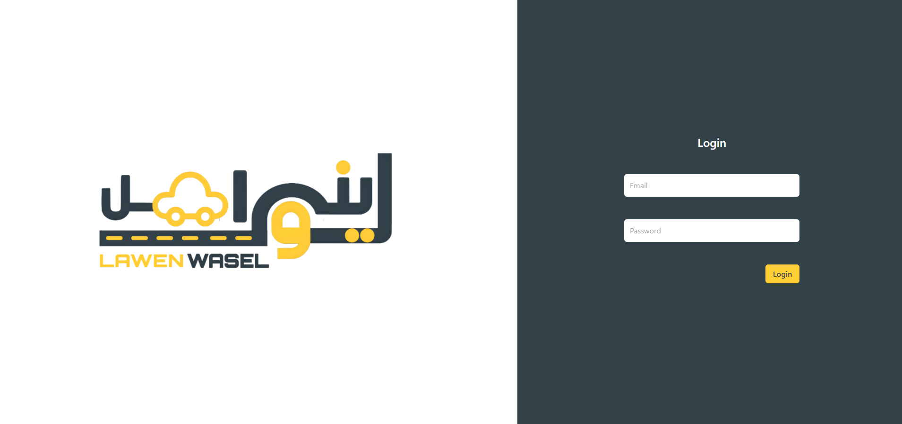
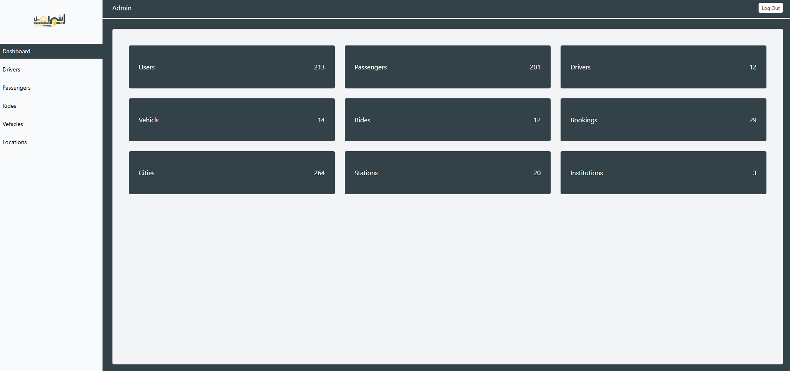
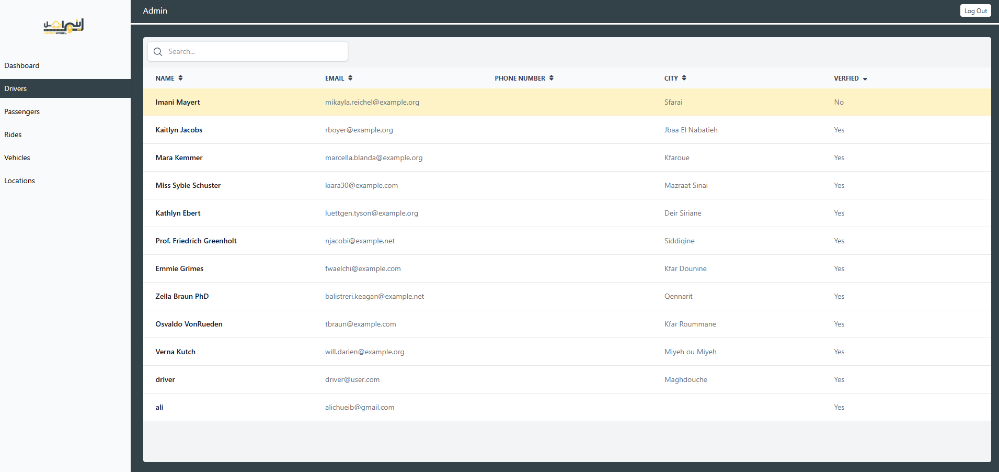
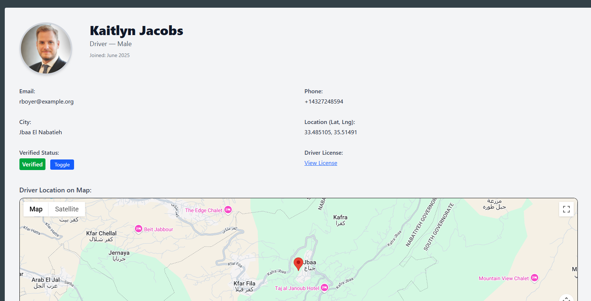
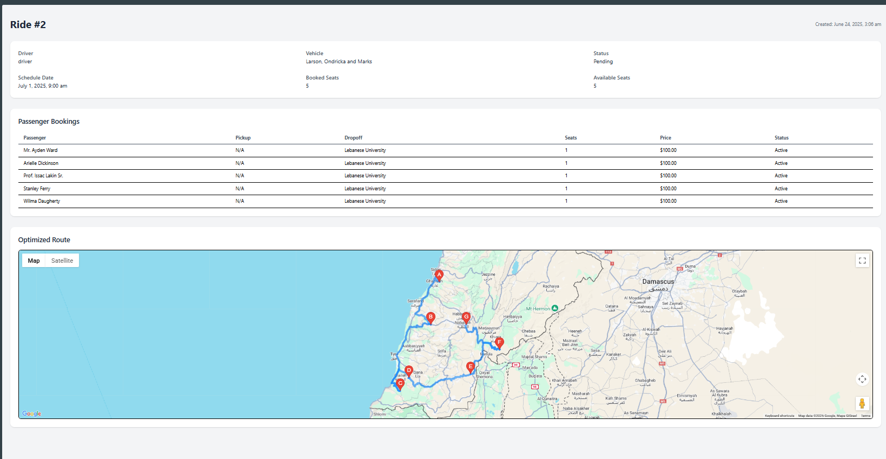
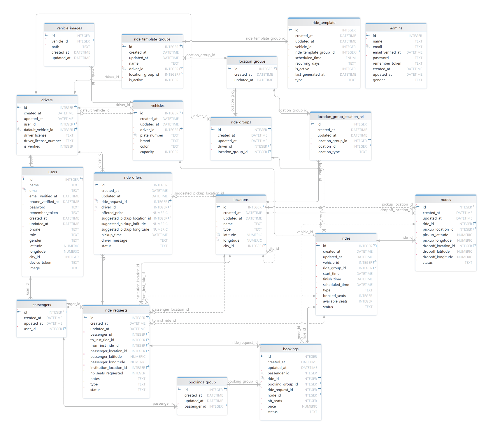

# Lawen Wasel - Student Ride Sharing Platform


A comprehensive Laravel-based ride-sharing platform designed specifically for university students, enabling them to find and share rides to and from their institutions. The system features a robust RESTful API, an intuitive admin panel, and advanced route optimization capabilities.

## 🌟 Key Features

### For Passengers
- **Smart Ride Search**: Search for available rides with filters for time windows, seat requirements, and pickup locations
- **Ride Requests**: Submit ride requests with specific pickup locations and institutions
- **Negotiation System**: Receive and accept custom offers from drivers with suggested pickup points and pricing
- **Booking Management**: Track active bookings, view ride details, and cancel reservations
- **Multi-Stop Support**: Automated pickup and dropoff point optimization

### For Drivers
- **Vehicle Management**: Register and manage multiple vehicles with image galleries
- **Ride Templates**: Create recurring ride schedules for regular routes (daily, weekly patterns)
- **Dynamic Ride Creation**: Set up one-time or recurring rides with customizable capacity and pricing
- **Ride Request Handling**: Review incoming passenger requests and accept/reject based on route compatibility
- **Custom Offers**: Send personalized ride offers with suggested pickup locations and pricing
- **Route Optimization**: Automatic multi-stop route optimization using OpenRouteService API
- **Driver Verification**: Verification system to ensure driver authenticity

### Admin Panel
- **Dashboard Analytics**: Comprehensive overview of users, rides, bookings, and locations
- **User Management**: Monitor and manage both passengers and drivers
- **Driver Verification**: Toggle driver verification status with document review
- **Location Management**: CRUD operations for cities, stations, and institutions
- **Ride Monitoring**: View ride details, routes, and booking information
- **Vehicle Oversight**: Review registered vehicles and their documentation
- **Booking Tracking**: Monitor active and historical bookings

### Technical Features
- **Multi-Step Registration**: Secure registration with email verification codes
- **Role-Based Access Control**: Separate authentication guards for users and admins
- **API Authentication**: Laravel Sanctum for secure token-based authentication
- **Geolocation Support**: GPS coordinates for accurate pickup/dropoff locations
- **Google Maps Integration**: Reverse geocoding for address resolution
- **Route Optimization**: OpenRouteService integration for multi-stop route planning
- **Conflict Prevention**: Automatic detection of overlapping ride requests
- **Transaction Safety**: Database transactions for data integrity
- **Queue Support**: Background job processing for heavy operations
- **Email Notifications**: Password reset and verification code delivery

## 🛠️ Tech Stack

- **Framework**: Laravel 12.x
- **PHP Version**: 8.2+
- **Authentication**: Laravel Sanctum (API), Session-based (Admin)
- **Frontend**: Livewire 3.6 (Admin Panel)
- **Database**: MySQL/PostgreSQL
- **External APIs**:
  - Google Maps Geocoding API
  - OpenRouteService Optimization API

## 📸 Screenshots

### Admin Login

*Secure admin authentication interface*

### Dashboard Overview

*Admin dashboard with real-time analytics and system statistics*

### User Management

*Comprehensive user management showing drivers and passengers with verification status*

### User Profile

*Detailed user profile with activity history and rating information*

### Ride Details & Route Visualization

*Ride management interface with real-time route visualization using Google Maps and optimized waypoints*


## 📋 Prerequisites

- PHP 8.2 or higher
- Composer
- MySQL/PostgreSQL database
- Node.js and NPM (for frontend assets)
- Google Maps API Key
- OpenRouteService API Key

## 🚀 Installation

### 1. Clone the Repository
```bash
git clone https://github.com/Mhmdkh77/lawen-wasel.git
cd lawen-wasel/backend
```

### 2. Install Dependencies
```bash
composer install
npm install
```

### 3. Environment Configuration
```bash
cp .env.example .env
php artisan key:generate
```

### 4. Configure Database
Edit `.env` file with your database credentials:
```env
DB_CONNECTION=mysql
DB_HOST=127.0.0.1
DB_PORT=3306
DB_DATABASE=my_db
DB_USERNAME=your_username
DB_PASSWORD=your_password
```

### 5. Configure External Services
Add API keys to `.env`:
```env
# Google Maps
GOOGLE_MAPS_API_KEY=your_google_maps_key

# OpenRouteService
ORS_API_KEY=your_ors_api_key
```

### 6. Run Migrations
```bash
php artisan migrate
```

### 7. Seed Database (Optional)
```bash
php artisan db:seed
```

### 8. Build Frontend Assets
```bash
npm run build
# Or for development
npm run dev
```

### 9. Start Development Server
```bash
php artisan serve
```

Access the application at `http://localhost:8000`

## 📱 API Documentation

The platform provides a comprehensive RESTful API with 30+ endpoints for seamless integration.

### Quick Start

**Base URL**: `http://localhost:8000/api`

**Authentication**: All protected endpoints require Bearer token authentication
```http
Authorization: Bearer {your_token}
```

### Core Features

- **Multi-step registration** with email verification
- **Dual-role authentication** (passengers and drivers)
- **Ride search and matching** with advanced filters
- **Real-time booking management**
- **Driver offer/request system**
- **Vehicle and location management**

### Endpoint Categories

- 🔐 **Authentication** - Register, login, password reset
- 👤 **User Management** - Profile, preferences, settings
- 🚗 **Passenger Endpoints** - Search rides, bookings, requests
- 🚙 **Driver Endpoints** - Rides, vehicles, offers, templates
- 📍 **Location Endpoints** - Cities, stations, institutions

### Example Request

```bash
# Login
curl -X POST http://localhost:8000/api/login \
  -H "Content-Type: application/json" \
  -d '{
    "login": "user@example.com",
    "password": "password123"
  }'
```

**For detailed endpoint documentation, request/response examples, and authentication flows, see the [complete API documentation](docs/API-docs.md).**

## 🗄️ Database Schema

### Entity Relationship Diagram


*Complete database schema showing all tables and relationships*


### Core Tables

- **users**: User accounts (passengers and drivers)
- **admins**: Admin panel users
- **passengers**: Passenger-specific data
- **drivers**: Driver profiles and verification status
- **vehicles**: Driver vehicles with specifications
- **locations**: Cities, stations, and institutions with GPS coordinates
- **rides**: Individual ride instances
- **ride_groups**: Groups rides by route and driver
- **ride_templates**: Recurring ride schedules
- **bookings**: Passenger seat reservations
- **nodes**: Multi-stop pickup/dropoff points
- **ride_requests**: Passenger ride requests
- **ride_offers**: Driver custom offers to passengers


## 🏗️ Architecture Highlights

### Design Patterns
- **Repository Pattern**: Clean separation of business logic
- **Service Layer**: LocationService for external API integration
- **Middleware Authentication**: Role-based access control
- **Eloquent Relationships**: Complex many-to-many and polymorphic relations
- **Database Transactions**: Ensuring data consistency

### Key Algorithms
- **Ride Matching**: Time-window based filtering with geospatial proximity
- **Route Optimization**: Shipment-based TSP solving via OpenRouteService
- **Conflict Detection**: Prevents overlapping bookings for passengers
- **Dynamic Seat Calculation**: Real-time availability tracking

### Security Features
- Password hashing (bcrypt)
- API token authentication
- CSRF protection
- SQL injection prevention (Eloquent ORM)
- XSS protection
- Email verification


## 📂 Project Structure

```
app/
├── Http/
│   ├── Controllers/
│   │   ├── Api/              # API Controllers
│   │   └── Admin/            # Admin Panel Controllers
│   └── Middleware/           # Custom Middleware
├── Models/                   # Eloquent Models
├── Services/                 # Business Logic Services
└── Mail/                     # Email Templates

database/
├── migrations/               # Database Migrations
├── seeders/                  # Database Seeders
└── factories/                # Model Factories

routes/
├── api.php                   # API Routes
└── web.php                   # Admin Panel Routes

resources/
└── views/                    # Blade Templates (Admin Panel)
```
