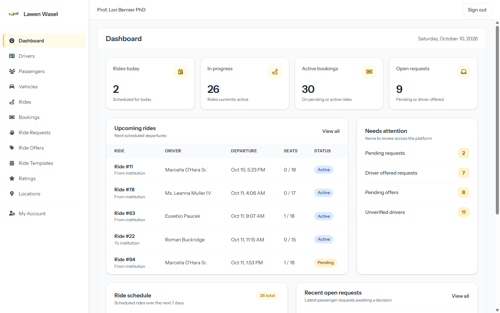
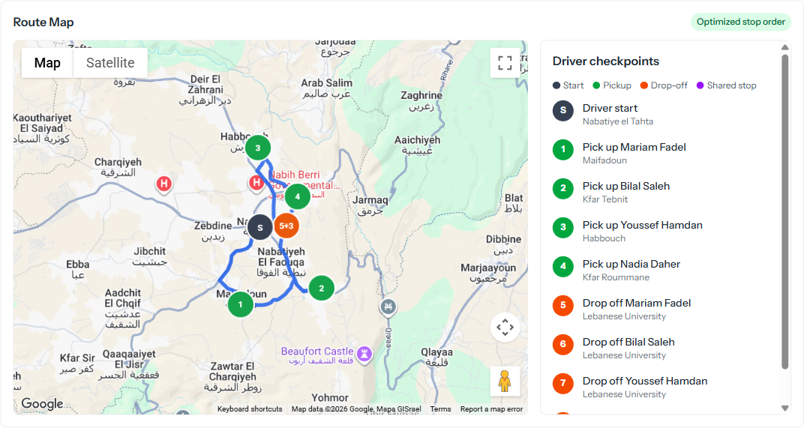

# Lawen Wasel - Student Ride Sharing Platform


A Laravel-based ride-sharing platform for students traveling to and from their institutions. This repository contains the JSON API for passenger and driver clients and a Livewire admin panel; a mobile client is not included. The driver API can return optimized stops, while the admin ride page displays numbered checkpoints and a map.

## Screenshots

These screens were captured from a freshly seeded local demo database in October 2026. The names and accounts shown are demo data.





More views: [admin login](docs/screenshots/admin_login.png), [ride details and bookings](docs/screenshots/ride_detail.png), and [ride requests](docs/screenshots/ride_requests.png).

## 🌟 Key Features

### For Passengers
- **Smart Ride Search**: Search available rides by arrival/return time windows, seat count, and institution
- **Ride Requests**: Submit ride requests with a pickup location and institution destination
- **Negotiation System**: Receive and accept custom driver offers with suggested pickup points and pricing
- **Booking Management**: Track active bookings, view ride details, and cancel reservations
- **Multi-Stop Support**: Rides pool multiple passengers per vehicle with per-passenger pickup/dropoff nodes

### For Drivers
- **Vehicle Management**: Register and manage multiple vehicles with image galleries
- **Ride Templates**: Define recurring weekly schedules; the scheduled command generates rides when Laravel's scheduler is running
- **Dynamic Ride Creation**: Set up one-time rides with a specific vehicle, time, and stop list
- **Ride Request Handling**: Review incoming passenger requests and accept/reject them
- **Custom Offers**: Send personalized ride offers with suggested pickup locations and pricing
- **Route Optimization**: Multi-stop route ordering via the OpenRouteService optimization API
- **Driver Verification**: Admin-gated verification before a driver can publish rides or templates

### Admin Panel
- **Operations Dashboard**: Today's rides, active bookings, open requests, items needing attention, upcoming rides, and a seven-day schedule
- **Passenger and Driver Profiles**: Inspect passenger and driver records
- **Driver Verification**: Toggle driver verification status
- **Admin Accounts**: Update your own name, email, and password; super admins can create accounts, change admin access, and disable or re-enable accounts
- **Location Management**: CRUD operations for cities, stations, and institutions
- **Ride Monitoring**: View ride details, numbered driver checkpoints, road routes, and booking information
- **Vehicle Oversight**: Review registered vehicles and their images
- **Booking Tracking**: Monitor active and historical bookings

### Technical Features
- **Multi-Step Registration**: Email-verification-code flow before account creation
- **Role-Based Access Control**: Driver and passenger API middleware, a distinct admin auth guard, and super admin restrictions for account management
- **API Authentication**: Laravel Sanctum for token-based mobile API auth
- **Geolocation Support**: GPS coordinates on users, locations, and ride pickup/dropoff nodes
- **Google Maps Integration**: Reverse geocoding, admin-side route visualization, and a road route fallback
- **Route Optimization**: OpenRouteService integration for multi-stop route planning
- **Conflict Prevention**: Detects duplicate/overlapping ride requests per passenger
- **Transaction Safety**: Database transactions and row locking around booking/seat updates
- **Email Notifications**: Verification codes and password-reset codes via Mail

## 🛠️ Tech Stack

- **Framework**: Laravel 12.x
- **PHP Version**: 8.2+
- **Authentication**: Laravel Sanctum (API), session-based guard (Admin)
- **Frontend**: Livewire 3.6 + Tailwind CSS (Admin Panel)
- **Database**: SQLite by default; local demo records are generated by seeders
- **External APIs**:
  - Google Maps JavaScript, Routes, and Geocoding APIs
  - OpenRouteService Optimization API
  - Twilio (phone-verification code exists, but the routes are disabled)
  - Firebase Cloud Messaging (push service exists, but calls from the ride flows are commented out)

## 📋 Prerequisites

- PHP 8.2 or higher
- Composer
- SQLite (default) or MySQL/PostgreSQL
- Node.js and NPM (for admin panel frontend assets)
- *(Optional)* Google Maps API key for the admin ride map and reverse geocoding
- *(Optional)* OpenRouteService API key for optimized stop order and route geometry

Twilio and Firebase credentials are not needed to run the active routes. Their unfinished flows have not been tested end to end.

## 🚀 Installation

### 1. Clone the Repository
```bash
git clone https://github.com/Mhmdkh77/lawen-wasel.git
cd lawen-wasel/backend
```

### 2. Install Dependencies
```bash
composer install
npm install
```

Run the remaining commands from the `backend` directory. PHP needs the SQLite extensions (`pdo_sqlite` and `sqlite3`) for the default database.

### 3. Environment Configuration
```bash
cp .env.example .env
php artisan config:clear
php artisan key:generate
```
On PowerShell, use `Copy-Item .env.example .env` instead of `cp`. The `.env` file stays local and should not be committed.

### 4. Configure the Database
Database files are not committed. The default `.env.example` uses SQLite. Create an empty local file from the `backend` directory:

```bash
# macOS/Linux
touch database/database.sqlite
```

```powershell
# PowerShell
New-Item database/database.sqlite -ItemType File
```

Then run the migrations and local seed in steps 6 and 7. Your SQLite file is ignored by Git and remains on your computer.

To use a fresh MySQL database instead, create the database and edit `.env`:
```env
DB_CONNECTION=mysql
DB_HOST=127.0.0.1
DB_PORT=3306
DB_DATABASE=my_db
DB_USERNAME=your_username
DB_PASSWORD=your_password
```

### 5. Configure External Services
Add only the services you need to `.env` (none of these keys are pre-filled in `.env.example`):
```env
# Google Maps (reverse geocoding + admin route map)
GOOGLE_MAPS_API_KEY=your_google_maps_key

# OpenRouteService / HeiGIT VROOM (multi-stop route optimization)
ORS_API_KEY=your_ors_api_key
```

The admin panel and API can start without either key. To display the admin ride map, configure a Google Cloud project with billing and the Maps JavaScript API. The map uses the [Routes Library](https://developers.google.com/maps/documentation/javascript/routes/start) when it needs Google to draw a road line, so enable the Routes API too. Reverse geocoding also needs the Geocoding API. The current code uses the same Google key in the browser and on the server, so a key restricted only to website referrers (such as `http://127.0.0.1:8000/*`) can break server-side geocoding. A production setup should change the configuration to use separately restricted browser and server keys.

The ride page displays numbered checkpoints in driver order: `S` for the start, green for pickup, orange for drop-off, and purple when different checkpoint types share a location. OpenRouteService can optimize the stop order and return road geometry. If it does not return geometry, Google's Routes Library tries to draw a road route through the displayed checkpoints. If road directions are unavailable from both services, a dashed orange line shows checkpoint order only; it is not a drivable route. Without OpenRouteService, the checkpoints follow their saved order. To enable optimization, configure an OpenRouteService key with VROOM access and allow the PHP server to reach `https://api.heigit.org/vroom/v0`.

Restart the server after changing `.env` values; if configuration is cached, run `php artisan config:clear` first.

The default `MAIL_MAILER=log` writes registration and password-reset codes to `storage/logs/laravel.log`. Configure SMTP in `.env` if you need real email delivery.

The Twilio phone-verification methods are not exposed as routes. Firebase has a service class, but the ride-flow calls are commented out. Adding credentials alone will not enable either feature.

### 6. Apply Database Migrations
```bash
php artisan migrate
```
Run this for a new database or to apply new migrations to an existing installation without clearing its data. To deliberately rebuild a disposable local database from scratch, `php artisan migrate:fresh --seed` deletes all tables and data before recreating and seeding them.

### 7. Seed Local Demo Data (Optional)
```bash
php artisan db:seed
```
Run this only once after migrating a fresh local database. Re-running the full seeder can duplicate the demo admin and fail. It creates a demo admin (`admin@admin.com` / `admin`), passenger (`passenger@user.com` / `pass`), and driver (`driver@user.com` / `pass`), plus sample locations, vehicles, and rides. See `database/seeders/DatabaseSeeder.php`. Do not deploy these published credentials.

The seed also adds a named showcase around Nabatieh: a five-seat, four-booking campus route; linked outbound and return bookings; a full active ride; a completed ride with reviews; a canceled ride; competing driver offers; requests in several statuses; vehicle photos; and active and paused recurring templates. Look for `SHOW-` vehicle plates and `Showcase |` template groups in the admin panel. Showcase users have `showcase.<name>@example.test` emails and the demo password `pass`.

To add only these connected scenarios to an existing database, without re-running the random demo seed, use:
```bash
php artisan db:seed --class=ShowcaseSeeder
```
The showcase seeder can be run again without duplicating its records.

### 8. Link Public Storage
```bash
php artisan storage:link
```
Required for vehicle images, profile pictures, and driver license uploads to resolve to a working URL.

### 9. Build Frontend Assets
```bash
npm run build
# or, for development with hot reload:
npm run dev
```

### 10. Start the Development Server
```bash
php artisan serve
```
On Windows, use `./serve-fast.ps1` from `backend` for faster local page loads. It runs the same development server with PHP OPcache enabled; PHP must include `php_opcache.dll`. Route optimization is cached after the first successful request, so reopening a ride does not wait for the routing API again.

Access the admin panel at `http://localhost:8000/admin/login`. The app has no page at `/`.

#### Admin accounts

Every active admin can open **My Account** (`/admin/account`) to update their name, email, and password. Changing the email or password requires the current password; changing the password signs the admin out.

Only a super admin can open **Admin Users** (`/admin/admins`) to create an admin with an initial password, grant or remove super admin access, and disable or re-enable an account. Disabled admins cannot sign in or continue an existing session. A super admin cannot disable or demote their own account. There is no email invitation flow for newly created admins.

The seeded `admin@admin.com` account is a super admin; change its demo password before using the app beyond local development. When the admin-access migration runs on an existing database, it grants super admin access to the oldest admin account.

### Public deployment

The repository is configured for local development and does not currently include a maintained deployment setup. A public instance needs its own persistent database, private environment variables, non-demo admin credentials, and a plan for uploaded files. The local SQLite database and uploaded data should not be copied into a public deployment.

### 11. (Optional) Enable Recurring Ride Generation
Driver-defined Ride Templates rely on a daily scheduled command to create rides for the current day. The command is scheduled for 00:05 in the app timezone:
```bash
php artisan app:generate-daily-rides   # run manually, or:
```
```bash
# crontab, for production (run from the backend directory)
* * * * * cd /path/to/lawen-wasel/backend && php artisan schedule:run >> /dev/null 2>&1
```

## 📱 API Documentation

The platform exposes a RESTful JSON API for the mobile clients.

### Quick Start

**Base URL**: `http://localhost:8000/api`

**Authentication**: protected endpoints require a Sanctum bearer token
```http
Authorization: Bearer {your_token}
```

### Endpoint Categories

- 🔐 **Authentication** — register (multi-step), login, password reset
- 👤 **User** — profile, password change, logout
- 🚗 **Passenger** — search rides, ride requests, ride offers, bookings
- 🚙 **Driver** — vehicles, ride templates, ride requests/offers, rides
- 📍 **Locations** — cities, stations, institutions

### Example Request

```bash
curl -X POST http://localhost:8000/api/login \
  -H "Content-Type: application/json" \
  -d '{
    "login": "passenger@user.com",
    "password": "pass"
  }'
```

**For an endpoint overview, see [docs/API-docs.md](docs/API-docs.md).**

## 🗄️ Database Schema

The migrations in `backend/database/migrations` are the source of truth for the schema. No database file is committed. The main tables are:

### Core Tables

- **users**: User accounts (passengers and drivers)
- **admins**: Admin panel users, active status, and super admin access
- **passengers** / **drivers**: Role-specific profile data
- **vehicles** / **vehicle_images**: Driver vehicles and their photos
- **locations**: Cities, stations, and institutions with GPS coordinates
- **rides** / **ride_groups**: Individual ride instances, grouped by route + driver
- **ride_templates** / **ride_template_groups**: Recurring schedules drivers define once
- **ride_requests** / **ride_offers**: The passenger-request / driver-offer negotiation flow
- **bookings** / **booking_groups**: Confirmed seat reservations
- **nodes**: Per-booking pickup/dropoff points used for route optimization

## 🏗️ Architecture Highlights

### Design Patterns
- **Service Layer**: `LocationService` (geocoding, route optimization), `BookingStopService` (pickup/drop-off direction), and dormant `NotificationService` / `FirebaseService` push code
- **Middleware Authentication**: `driver`, `driver-verified`, and `passenger` API middleware; an `admin` auth guard with `admin-active` and `super-admin` middleware for the panel
- **Eloquent Relationships**: `hasManyThrough` for driver → vehicle → ride ownership chains; many-to-many for location groups
- **Database Transactions**: Booking/ride creation wraps multi-table writes in transactions with row locking on seat counts

### Key Algorithms
- **Ride Matching**: Time-window filtering (±1 hour) plus institution/city matching
- **Route Optimization**: Shipment-based routing via the OpenRouteService optimization API
- **Conflict Detection**: Prevents a passenger from double-booking overlapping rides
- **Seat Tracking**: `available_seats`/`booked_seats` kept in sync via transactional increments/decrements

### Security Features
- Password hashing (bcrypt)
- Sanctum API token authentication
- CSRF protection (admin panel)
- Current-password checks for admin email and password changes, and blocked access for disabled admin accounts
- Eloquent ORM parameter binding (SQL injection prevention)
- Rate-limited auth/registration endpoints
- Email verification before account activation

## 📂 Project Structure

The paths below are relative to `backend/`.

```
app/
├── Http/
│   ├── Controllers/
│   │   ├── Api/              # API Controllers
│   │   └── Admin/            # Admin Panel Controllers
│   └── Middleware/           # Custom Middleware
├── Livewire/                 # Admin panel Livewire components
├── Models/                   # Eloquent Models
├── Services/                 # Business Logic Services
├── Policies/                 # Authorization policies
└── Mail/                     # Email Templates

database/
├── migrations/               # Database Migrations
├── seeders/                  # Database Seeders
└── factories/                # Model Factories

routes/
├── api.php                   # API Routes
├── web.php                   # Admin Panel Routes
└── console.php                # Scheduled commands

resources/
└── views/                    # Blade Templates (Admin Panel)
```

## 🧪 Running Tests

```bash
php artisan test
```
The feature tests cover admin account changes, super admin permissions, disabled sessions, admin pages and pagination, showcase seed data, route checkpoints, driver ride-request access and acceptance, and multiple offers on a passenger request. Broader API coverage is still needed.
